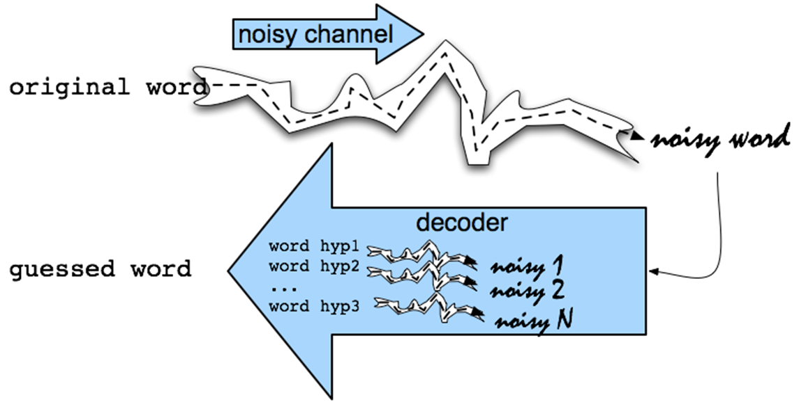

<h1>Urdu Spell Corrector</h1>

<p>
  This is a Urdu Spell Corrector using Noisy Channel Model implemented in Python3.

  It involves the following steps:

  - <b>Train a bigram language model</b> on language corpus (jang.txt).

```
biwordCount(word[0] | word[1]) / unigramCount(word[0])
```

  - For all the error words in Error words corpus (jang_errors.txt), <b>find the candidate words</b> that are one and two edit distance away from the error word. Use dictionary (wordlist.txt) to reduce your search space i.e. remove invalid candidates.

  
```
(newBiwordCount(word[0] | word[1]) + 1) /(unigramCount(word[0]) + lengthOf(‘jang.txt’))
```

  - For all the error words, <b>rank the candidate words</b> on the basis of prior probability obtained from the language model (jang_nonerrors.txt).
  
  - For <b>prediction and correction</b>, select top 10 candidate words for an error word. If any of the 10 words exists in ‘jang_nonerrors.txt’ at that precise location of same sentence then that true word is highlighted. Otherwise, all candidates words with their probabilities are listed.

</p>

<br>



<hr>

## Using for other language corpus

<p>

This word spell corrector can be trained on other any language corpus just by changing the path of corpus file and adding the character set of language.

In Urdu Spell Corrector.ipynb, cell#2 contains the following code:

```
with open('./jang_errors.txt', 'r', encoding='utf8', errors='ignore') as f:
    erorrsFile = f.readlines() # wrongly spelled file
```
This line contains the path of file having sentences which includes the error words.

```
with open('./jang_nonerrors.txt', 'r', encoding='utf8', errors='ignore') as f:
    correctedFile = f.readlines() # correctly spelled file
```
This line contains the path of file having same sentences without any error. It is used to compare the results at the end.

```
with open('./wordlist.txt', 'r', encoding='utf8', errors='ignore') as f:
    wordsFile = f.readlines() # list of valid urdu words, dictionary
```
This line contains the path of file having list of valid language vocabulary.

In Urdu Spell Corrector.ipynb, cell#3 contains the following code:
```
 urdu_charset='ابپتٹثجچحخدڈذرڑزژسشصضطظعغفقکگلمنںوہھءیے' # urdu charset
 ```    
This is the character set of a language.
     
Now you are ready to make your own Word Spell Corrector using Noisy Channel Model.

</p>

<hr>

## Author 👋

You can get in touch with me on my LinkedIn Profile:

#### Ahmad Shafique

[](https://www.linkedin.com/in/ahmad-shafique)

You can also follow my GitHub Profile to stay updated about my latest projects: [](https://github.com/ahmadshafique)


If you liked the repo then please support it by giving it a star ⭐!

<hr>

## Contributions Welcome ✨


If you find any bug in the code or have any improvements in mind then feel free to generate a pull request.

<hr>

## License 📄

[](LICENSE)

Copyright (c) 2020, Ahmad Shafique
